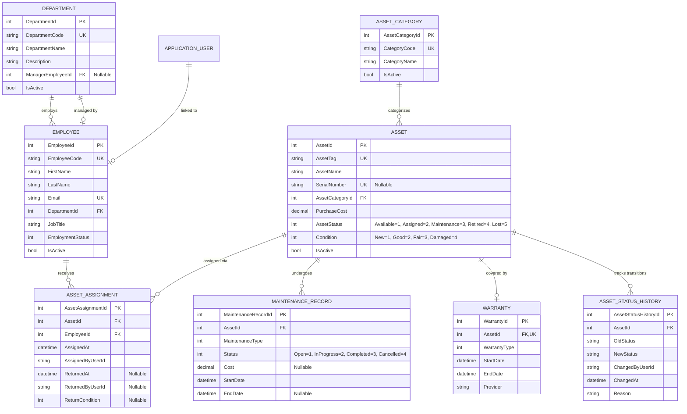
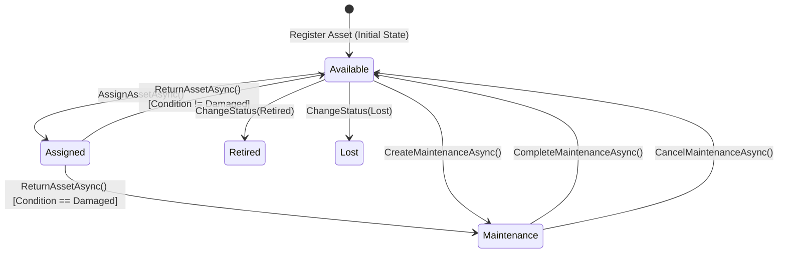
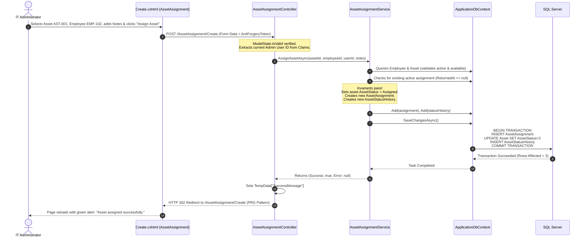
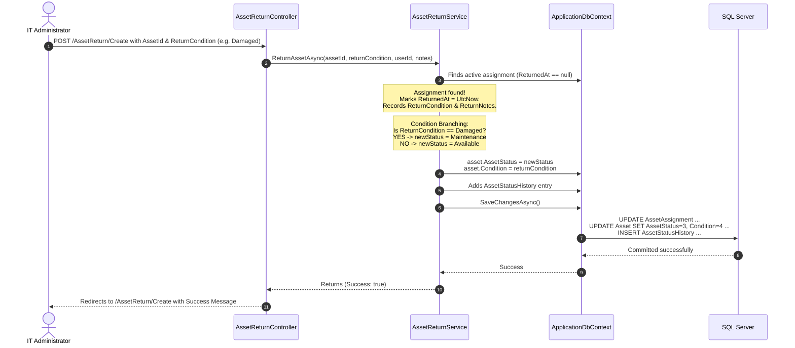
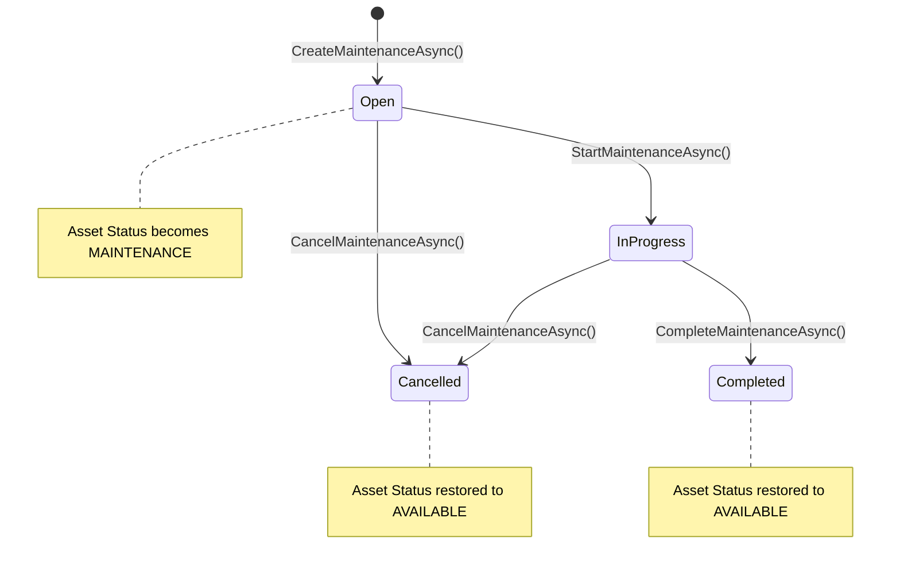
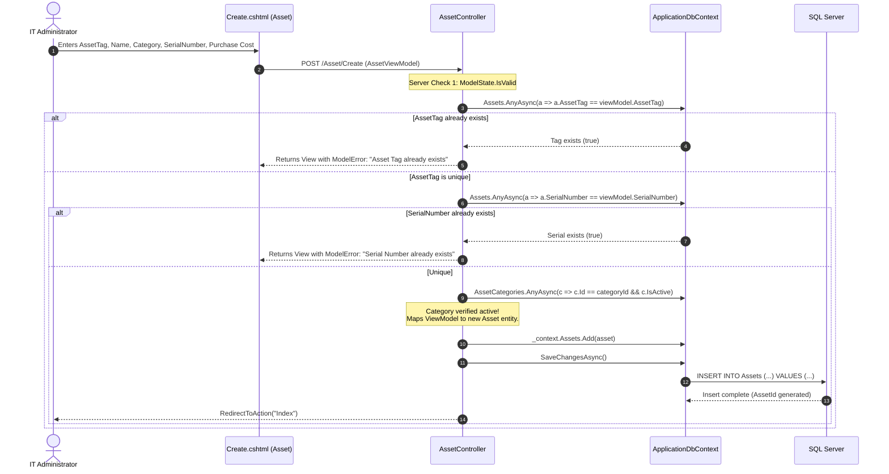
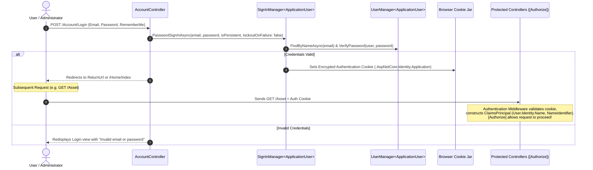

# AssetHub – Complete Project Flow & Architecture Master Guide

> **Document Purpose:** This document explains the comprehensive working of the **AssetHub** IT Asset Management System. It details every architectural layer, tracing execution file-by-file from user UI interactions (button clicks) through the HTTP request lifecycle, controller routing, view model validation, domain business services, Entity Framework Core data context tracking, SQL Server database persistence, and back to view rendering.
>
> Use this guide to understand the entire codebase, onboard new developers, explain system design, and answer any technical or architectural questions regarding "How this works?".

---

## Table of Contents

1. [High-Level Architecture & Tech Stack](#1-high-level-architecture--tech-stack)
2. [Project Directory & File Structure](#2-project-directory--file-structure)
3. [The Request-Response Lifecycle (The 10-Stage Pipeline)](#3-the-request-response-lifecycle-the-10-stage-pipeline)
4. [Database Architecture & Entity Relationships](#4-database-architecture--entity-relationships)
5. [Asset Lifecycle State Machine](#5-asset-lifecycle-state-machine)
6. [Deep-Dive Scenario Walkthroughs (File-to-File Flow)](#6-deep-dive-scenario-walkthroughs-file-to-file-flow)
   - [Scenario A: Asset Assignment Workflow](#scenario-a-asset-assignment-workflow)
   - [Scenario B: Asset Return with Condition Branching](#scenario-b-asset-return-with-condition-branching)
   - [Scenario C: Maintenance Workflow (Open → InProgress → Completed/Cancelled)](#scenario-c-maintenance-workflow-open--inprogress--completedcancelled)
   - [Scenario D: Asset Registration with Validation & Duplicate Checks](#scenario-d-asset-registration-with-validation--duplicate-checks)
   - [Scenario E: Authentication, Cookie Issuance & Authorization](#scenario-e-authentication-cookie-issuance--authorization)
   - [Scenario F: Search, Filtering & Joined Read Queries](#scenario-f-search-filtering--joined-read-queries)
7. [Comprehensive "How This Works?" Q&A Reference](#7-comprehensive-how-this-works-qa-reference)
8. [System Flow Matrix & Cheat Sheet](#8-system-flow-matrix--cheat-sheet)

---

## 1. High-Level Architecture & Tech Stack

AssetHub is constructed using modern enterprise .NET patterns following the **Model-View-Controller (MVC) + Service Layer** pattern on top of **ASP.NET Core (.NET 10)**.

```
┌─────────────────────────────────────────────────────────────────────────────────┐
│                                 PRESENTATION LAYER                              │
│  Razor Views (.cshtml) + HTML5 / CSS3 (Bootstrap 5) + Client Validation (jQuery)│
└────────────────────────────────────────┬────────────────────────────────────────┘
                                         │ HTTP Request / Form POST / AntiForgery
                                         ▼
┌─────────────────────────────────────────────────────────────────────────────────┐
│                                CONTROLLER LAYER                                 │
│      Controllers: Routing, Model Binding, ModelState Validation, Action Results │
└────────────────────────────────────────┬────────────────────────────────────────┘
                                         │ DTOs / ViewModels / Parameter Transfer
                                         ▼
┌─────────────────────────────────────────────────────────────────────────────────┐
│                                 SERVICE LAYER                                   │
│  Domain Services: Business Rules, State Transitions, Audit Logging, Validations │
└────────────────────────────────────────┬────────────────────────────────────────┘
                                         │ Entities & Context Tracking
                                         ▼
┌─────────────────────────────────────────────────────────────────────────────────┐
│                               DATA ACCESS LAYER                                 │
│  ApplicationDbContext (EF Core 10) + ChangeTracker + Relational Mappings (SQL)  │
└────────────────────────────────────────┬────────────────────────────────────────┘
                                         │ T-SQL Commands (INSERT / UPDATE / SELECT)
                                         ▼
┌─────────────────────────────────────────────────────────────────────────────────┐
│                               DATABASE STORAGE                                  │
│             Microsoft SQL Server (Tables, Indexes, Foreign Keys, Rules)         │
└─────────────────────────────────────────────────────────────────────────────────┘
```

### Technology Stack Summary

| Component             | Technology / Library                   | Role & Purpose                                                    |
| :-------------------- | :------------------------------------- | :---------------------------------------------------------------- |
| **Framework**         | .NET 10 (`Microsoft.NET.Sdk.Web`)      | Core runtime and web hosting environment                          |
| **Presentation**      | ASP.NET Core MVC Razor Views           | Server-side HTML generation with Tag Helpers                      |
| **Styling & UI**      | Bootstrap 5 + Custom CSS (`site.css`)  | Responsive layouts, cards, navigation, badges                     |
| **Client Validation** | jQuery (`jquery.validate.unobtrusive`) | Immediate UI validation before form submission                    |
| **Data Access / ORM** | Entity Framework Core 10 (`SqlServer`) | Object-Relational Mapping, LINQ queries, change tracking          |
| **Security & Auth**   | ASP.NET Core Identity                  | Cookie-based authentication, password hashing, roles              |
| **Database**          | Microsoft SQL Server                   | Relational persistence, unique constraints, referential integrity |

### Architectural Principles

1. **Separation of Concerns (SoC):** Controllers do not contain complex transactional business logic; they delegate domain operations to dedicated service classes (`AssetAssignmentService`, `AssetReturnService`, `MaintenanceService`, etc.).
2. **ViewModel Separation:** Database entity models (`Asset`, `Employee`, `Department`) are never directly exposed to client forms. Instead, ViewModels (`AssetViewModel`, `AssetAssignmentViewModel`) handle data transfer, input validation, and dropdown lists.
3. **Auditing by Default:** Every status transition of an asset automatically logs an immutable record in `AssetStatusHistories`, tracking who changed it, when, why, and what notes were attached.
4. **Referential Safety:** Relational foreign keys use `DeleteBehavior.Restrict` on core operational entities to prevent accidental cascading data loss.

---

## 2. Project Directory & File Structure

Here is how the project files are organized and how each layer functions:

```
AssetHub/
├── Program.cs                         # Application entry point, DI container & middleware configuration
├── appsettings.json                   # Connection strings, logging & system settings
├── AssetHub.csproj                    # Project dependencies & framework target (net10.0)
│
├── Controllers/                       # Handles HTTP requests, coordinates services, returns Views
│   ├── AccountController.cs           # User registration, login, logout, identity cookies
│   ├── AssetController.cs             # Asset CRUD, search filters, manual status changes, activation
│   ├── AssetAssignmentController.cs   # Assigning assets to employees (GET/POST)
│   ├── AssetReturnController.cs       # Processing asset returns and condition evaluation (GET/POST)
│   ├── AssetCategoryController.cs     # Category management CRUD
│   ├── DepartmentController.cs        # Department management CRUD
│   ├── EmployeeController.cs          # Employee management CRUD & department assignment
│   ├── HomeController.cs              # Dashboard landing page & navigation
│   ├── MaintenanceController.cs       # Maintenance creation, starting, completing, cancelling
│   ├── WarrantyController.cs          # Warranty tracking and creation
│   └── AssetStatusHistoryController.cs# Audit trail viewer for asset state transitions
│
├── Services/                          # Core domain business logic & transaction orchestration
│   ├── AssetAssignmentService.cs      # Rules & logic for assigning available assets
│   ├── AssetReturnService.cs          # Rules for asset return, status branching & condition updates
│   ├── MaintenanceService.cs          # State transitions for maintenance workflow
│   ├── WarrantyService.cs             # Warranty date calculations & status evaluation
│   └── AssetStatusHistoryService.cs   # Queries for historical state timeline
│
├── Models/                            # Database entity definitions (mapped to DB tables)
│   ├── Asset.cs                       # Core asset record (Tag, Name, Cost, Status, Condition, etc.)
│   ├── AssetAssignment.cs             # Assignment history (AssetId, EmployeeId, AssignedAt, ReturnedAt)
│   ├── AssetCategory.cs               # Category grouping (Laptops, Desktops, Monitors, etc.)
│   ├── AssetStatusHistory.cs          # Audit record of status changes (OldStatus -> NewStatus)
│   ├── Department.cs                  # Organization departments
│   ├── Employee.cs                    # Employee details, department linkage, active status
│   ├── MaintenanceRecord.cs           # Maintenance events (Type, Status, Cost, Technician, Vendor)
│   ├── Warranty.cs                    # One-to-one warranty details linked to an Asset
│   ├── ApplicationUser.cs             # Identity user model inheriting from IdentityUser
│   ├── AuditLog.cs                    # Generic audit logging model
│   └── Enums/                         # Strongly typed domain states
│       ├── AssetStatus.cs             # Available, Assigned, Maintenance, Retired, Lost
│       ├── AssetCondition.cs          # New, Good, Fair, Damaged
│       ├── MaintenanceStatus.cs       # Open, InProgress, Completed, Cancelled
│       ├── MaintenanceType.cs         # Preventive, Repair, Upgrade, Inspection
│       ├── WarrantyStatus.cs          # Active, ExpiringSoon, Expired
│       ├── WarrantyType.cs            # Manufacturer, Extended, Vendor
│       └── EmploymentStatus.cs        # FullTime, PartTime, Contractor, Intern
│
├── ViewModels/                        # Strongly typed form models & UI data transfer objects (DTOs)
│   ├── AssetViewModel.cs              # Asset create/edit form data + validation rules
│   ├── AssetListViewModel.cs          # Grid listing display DTO
│   ├── AssetFilterViewModel.cs        # Search bar and dropdown filter bindings
│   ├── AssetAssignmentViewModel.cs    # Asset assignment form binding
│   ├── AssetReturnViewModel.cs        # Asset return form binding
│   ├── AssetStatusViewModel.cs        # Asset status transition form
│   ├── MaintenanceViewModel.cs        # Maintenance registration form
│   ├── WarrantyViewModel.cs           # Warranty registration form
│   ├── EmployeeViewModel.cs           # Employee create/edit form
│   ├── EmployeeListViewModel.cs       # Employee grid listing DTO
│   ├── DepartmentViewModel.cs         # Department form binding
│   ├── AssetCategoryViewModel.cs      # Category form binding
│   ├── LoginViewModel.cs              # User login form
│   └── RegisterViewModel.cs           # User registration form
│
├── Data/                              # Data access & database context
│   ├── ApplicationDbContext.cs        # EF Core DbContext, DbSets, Fluent API configurations
│   └── Seed/
│       └── RoleSeeder.cs              # Automatic database role seeding on startup
│
├── Views/                             # Razor templates (.cshtml)
│   ├── _ViewStart.cshtml              # Sets default master layout
│   ├── _ViewImports.cshtml            # Global namespace imports & Tag Helper declarations
│   ├── Shared/
│   │   ├── _Layout.cshtml             # App shell: Sidebar, TopBar, user profile, logout form
│   │   └── _ValidationScriptsPartial.cshtml # jQuery validation scripts inclusion
│   ├── Home/Index.cshtml              # Dashboard metrics, quick links & module shortcuts
│   ├── Asset/                         # Asset Index, Create, Edit, ChangeStatus views
│   ├── AssetAssignment/Create.cshtml  # Asset assignment form view
│   ├── AssetReturn/Create.cshtml      # Asset return form view
│   ├── Maintenance/                   # Maintenance Index and Create views
│   ├── Warranty/                      # Warranty Index and Create views
│   ├── Employee/                      # Employee Index, Create, Edit views
│   ├── Department/                    # Department Index, Create, Edit views
│   ├── AssetCategory/                 # Category Index, Create, Edit views
│   ├── AssetStatusHistory/Index.cshtml# Timeline audit history table
│   └── Account/                       # Login and Register views
│
└── wwwroot/                           # Static browser assets (CSS, JS, Bootstrap, jQuery)
    ├── css/site.css                   # Custom modern styling (shell, cards, tables, badges)
    └── js/site.js                     # Global client-side JavaScript
```

---

## 3. The Request-Response Lifecycle (The 10-Stage Pipeline)

Whenever a user clicks a button in the browser (e.g., clicking **"Assign Asset"**), the operation proceeds through 10 distinct architectural stages:

```
[Browser Button Click]
         │  1. Triggers submit event / client validation
         ▼
[Client-side Validation] ────(Invalid)────> Highlights input errors on screen (No HTTP request sent)
         │  2. Validated
         ▼
[HTTP POST Request] ───────> Sends Form Data + Verification Token Cookie
         │  3. Network transfer
         ▼
[ASP.NET Core Middleware] ─> Exception Handler → Routing → Authentication → Authorization
         │  4. Authenticated & Authorized
         ▼
[Controller Model Binding] ─> Instantiates ViewModel, binds POST parameters, validates DataAnnotations
         │  5. Evaluates ModelState.IsValid
         ▼
[Business Service Call] ───> Checks domain invariants (e.g., Asset active? Asset available? Employee active?)
         │  6. Domain rules satisfied
         ▼
[EF Core Change Tracker] ──> Instantiates entity models, tracks state (Added, Modified)
         │  7. Unit of Work
         ▼
[Database Commit] ─────────> Executes parameterized SQL statements within a database transaction
         │  8. SQL Server commits rows
         ▼
[Controller Response] ─────> Stores TempData["SuccessMessage"] & executes RedirectToAction (PRG pattern)
         │  9. HTTP 302 Redirect
         ▼
[Browser View Render] ─────> Browser fetches destination GET URL, Razor renders HTML, displays success alert!
```

### Detailed Breakdown of the 10 Stages

1. **Stage 1 – UI Interaction & Event Triggering:**
   The user enters data into input fields (`<select>`, `<input>`, `<textarea>`) and clicks `<button type="submit">`.
2. **Stage 2 – Client-Side Validation:**
   `jquery.validate` and `jquery.validate.unobtrusive` inspect the HTML elements. Data-val attributes generated by Razor Tag Helpers (such as `data-val-required`) are evaluated in the browser. If any required field is empty, the browser immediately displays an inline error message and suppresses the HTTP request, saving bandwidth and server compute.
3. **Stage 3 – HTTP Request Dispatch:**
   If valid, the browser issues an `HTTP POST` request over HTTPS with `Content-Type: application/x-www-form-urlencoded`. The request payload includes the Anti-Forgery Token (`__RequestVerificationToken`), form values, and authentication cookies (`.AspNetCore.Identity.Application`).
4. **Stage 4 – Middleware Pipeline Processing:**
   In [Program.cs](file:///c:/Users/manav/source/repos/AssetHub%20-%20Web-Based%20IT%20Asset%20Management%20System/AssetHub/Program.cs#L35-L55):
   - `UseHttpsRedirection()` enforces HTTPS.
   - `UseRouting()` matches the URL route template (`{controller}/{action}/{id?}`).
   - `UseAuthentication()` decrypts the identity cookie and attaches the `ClaimsPrincipal` to `HttpContext.User`.
   - `UseAuthorization()` evaluates authorization attributes (e.g., `[Authorize]`). If the user is unauthenticated, they are immediately redirected to `/Account/Login`.
5. **Stage 5 – Controller Model Binding & Server Validation:**
   The framework instantiates the action parameter (e.g., `AssetAssignmentViewModel`) and maps incoming form keys to C# properties. It evaluates `DataAnnotations` (like `[Required]`, `[StringLength]`). If validation fails, `ModelState.IsValid` becomes `false`.
6. **Stage 6 – Domain Service Business Logic:**
   The controller extracts the current logged-in user ID (`User.FindFirstValue(ClaimTypes.NameIdentifier)`) and calls the injected domain service (e.g., `_assignmentService.AssignAssetAsync(...)`). The service performs integrity checks (e.g., verifying the asset isn't already assigned, checking that the employee is active, ensuring the asset is currently in `Available` status).
7. **Stage 7 – EF Core Unit of Work & Change Tracker:**
   The domain service instantiates the new database entities (`AssetAssignment`, `AssetStatusHistory`) and updates the state of existing entities (`asset.AssetStatus = AssetStatus.Assigned`). It attaches them to the `ApplicationDbContext`. EF Core marks entities as `Added` or `Modified`.
8. **Stage 8 – Database Transaction Execution:**
   `await _context.SaveChangesAsync()` is called. EF Core wraps all pending changes in an implicit SQL transaction, constructs parameterized `INSERT` and `UPDATE` SQL statements, and transmits them to SQL Server.
9. **Stage 9 – Controller Result & Post-Redirect-Get (PRG):**
   Upon receiving confirmation from SQL Server:
   - The controller sets `TempData["SuccessMessage"] = "Asset assigned successfully."`.
   - The controller returns `RedirectToAction(nameof(Create))`. This follows the **Post-Redirect-Get (PRG)** pattern, which prevents duplicate form submissions if the user refreshes their browser.
10. **Stage 10 – View Rendering & DOM Update:**
    The browser receives an `HTTP 302` redirect status, then immediately issues an `HTTP GET /AssetAssignment/Create`. The GET action re-loads dropdown options, reads `TempData["SuccessMessage"]`, and Razor renders the clean form accompanied by a green Bootstrap success alert banner.

---

## 4. Database Architecture & Entity Relationships

The data layer is configured in [ApplicationDbContext.cs](file:///c:/Users/manav/source/repos/AssetHub%20-%20Web-Based%20IT%20Asset%20Management%20System/AssetHub/Data/ApplicationDbContext.cs) with explicit constraints, foreign keys, unique indices, and precision rules.

### Entity Relationship Diagram (ERD)



### Relational Integrity Rules in `ApplicationDbContext`

| Parent Entity     | Child Entity         | Foreign Key         | Delete Behavior | Rationale                                                                     |
| :---------------- | :------------------- | :------------------ | :-------------- | :---------------------------------------------------------------------------- |
| `Department`      | `Employee`           | `DepartmentId`      | `Restrict`      | Prevents deleting a department if employees belong to it.                     |
| `Employee`        | `Department`         | `ManagerEmployeeId` | `SetNull`       | If a manager employee is removed, the department manager field becomes null.  |
| `AssetCategory`   | `Asset`              | `AssetCategoryId`   | `Restrict`      | Cannot delete a category that still contains registered assets.               |
| `Asset`           | `AssetAssignment`    | `AssetId`           | `Restrict`      | History preservation: assigned assets cannot be wiped.                        |
| `Employee`        | `AssetAssignment`    | `EmployeeId`        | `Restrict`      | Prevents deleting an employee who has historical or active asset assignments. |
| `Asset`           | `MaintenanceRecord`  | `AssetId`           | `Restrict`      | Protects maintenance audit trails.                                            |
| `Asset`           | `Warranty`           | `AssetId`           | `Cascade`       | One-to-one link; if an asset is destroyed, its warranty is deleted.           |
| `Asset`           | `AssetStatusHistory` | `AssetId`           | `Restrict`      | Immutable compliance audit history cannot be orphan-deleted.                  |
| `ApplicationUser` | `Employee`           | `EmployeeId`        | `SetNull`       | Decouples user login accounts from human employee records.                    |

---

## 5. Asset Lifecycle State Machine

AssetHub enforces strict state management rules for assets to ensure no duplicate allocations, invalid transitions, or untracked equipment movements occur.



### State Definitions & Valid Transitions

1. **`Available` (Value = 1):**
   - The asset is in inventory, functional, and ready for deployment.
   - _Allowed transitions:_ Can be **Assigned** to an employee, moved to **Maintenance**, marked **Retired**, or marked **Lost**.
2. **`Assigned` (Value = 2):**
   - The asset is currently held by an active employee.
   - _Allowed transitions:_ Can only transition via **Return**. It cannot be directly edited to Maintenance or Assigned to someone else.
3. **`Maintenance` (Value = 3):**
   - The asset is undergoing repair, diagnostic testing, or upgrades.
   - _Allowed transitions:_ When maintenance is **Completed** or **Cancelled**, the asset returns to **Available**.
4. **`Retired` (Value = 4) / `Lost` (Value = 5):**
   - Terminal lifecycle states. The asset is no longer deployable.

---

## 6. Deep-Dive Scenario Walkthroughs (File-to-File Flow)

### Scenario A: Asset Assignment Workflow

_User assigns Laptop `AST-001` to Employee `EMP-102`._



#### Step-by-Step Code Walkthrough

1. **User Action in Razor View:**
   File: [AssetAssignment/Create.cshtml](file:///c:/Users/manav/source/repos/AssetHub%20-%20Web-Based%20IT%20Asset%20Management%20System/AssetHub/Views/AssetAssignment/Create.cshtml#L54-L157)
   ```html
   <form asp-action="Create" method="post">
     @Html.AntiForgeryToken()
     <select
       asp-for="AssetId"
       asp-items="ViewBag.Assets"
       class="form-select"
     ></select>
     <select
       asp-for="EmployeeId"
       asp-items="ViewBag.Employees"
       class="form-select"
     ></select>
     <textarea asp-for="AssignmentNotes" class="form-control"></textarea>
     <button type="submit" class="btn btn-primary">Assign Asset</button>
   </form>
   ```
2. **Controller Action Handling:**
   File: [AssetAssignmentController.cs](file:///c:/Users/manav/source/repos/AssetHub%20-%20Web-Based%20IT%20Asset%20Management%20System/AssetHub/Controllers/AssetAssignmentController.cs#L34-L63)

   ```csharp
   [HttpPost]
   [ValidateAntiForgeryToken]
   public async Task<IActionResult> Create(AssetAssignmentViewModel model)
   {
       if (!ModelState.IsValid)
       {
           await LoadDropdownsAsync();
           return View(model);
       }

       var assignedByUserId = User.FindFirstValue(ClaimTypes.NameIdentifier);

       var result = await _assignmentService.AssignAssetAsync(
           model.AssetId,
           model.EmployeeId,
           assignedByUserId,
           model.AssignmentNotes);

       if (!result.Success)
       {
           ModelState.AddModelError(string.Empty, result.ErrorMessage!);
           await LoadDropdownsAsync();
           return View(model);
       }

       TempData["SuccessMessage"] = "Asset assigned successfully.";
       return RedirectToAction(nameof(Create));
   }
   ```

3. **Domain Service Validation & Unit of Work:**
   File: [AssetAssignmentService.cs](file:///c:/Users/manav/source/repos/AssetHub%20-%20Web-Based%20IT%20Asset%20Management%20System/AssetHub/Services/AssetAssignmentService.cs#L16-L95)
   - Checks that the employee exists and `employee.IsActive` is `true`.
   - Checks that the asset exists and `asset.IsActive` is `true`.
   - Checks that `asset.AssetStatus == AssetStatus.Available`.
   - Ensures no record in `_context.AssetAssignments` has `AssetId == assetId && ReturnedAt == null`.
   - Updates `asset.AssetStatus = AssetStatus.Assigned`.
   - Adds new `AssetAssignment` and `AssetStatusHistory` records.
   - Calls `await _context.SaveChangesAsync()`.

---

### Scenario B: Asset Return with Condition Branching

_Employee returns an asset. If marked `Damaged`, it automatically routes to `Maintenance`. If marked `Good` or `Fair`, it returns to `Available`._



#### Key Logic in `AssetReturnService.cs`

File: [AssetReturnService.cs](file:///c:/Users/manav/source/repos/AssetHub%20-%20Web-Based%20IT%20Asset%20Management%20System/AssetHub/Services/AssetReturnService.cs#L45-L77)

```csharp
assignment.ReturnedAt = now;
assignment.ReturnedByUserId = returnedByUserId;
assignment.ReturnCondition = returnCondition;
assignment.ReturnNotes = returnNotes;

// Automatic status determination:
var newStatus = returnCondition == AssetCondition.Damaged
    ? AssetStatus.Maintenance
    : AssetStatus.Available;

var oldStatus = asset.AssetStatus;
asset.AssetStatus = newStatus;
asset.Condition = returnCondition;
asset.UpdatedAt = now;

var statusHistory = new AssetStatusHistory
{
    AssetId = asset.AssetId,
    OldStatus = oldStatus.ToString(),
    NewStatus = newStatus.ToString(),
    ChangedByUserId = returnedByUserId,
    ChangedAt = now,
    Reason = "Asset returned by employee.",
    Notes = returnNotes
};

_context.AssetStatusHistories.Add(statusHistory);
await _context.SaveChangesAsync();
```

---

### Scenario C: Maintenance Workflow (Open → InProgress → Completed/Cancelled)

_Managing asset repairs through the four-stage lifecycle._



#### Step-by-Step Method Breakdown in `MaintenanceService.cs`

File: [MaintenanceService.cs](file:///c:/Users/manav/source/repos/AssetHub%20-%20Web-Based%20IT%20Asset%20Management%20System/AssetHub/Services/MaintenanceService.cs)

1. **`CreateMaintenanceAsync`:**
   - Pre-condition: Asset must be `IsActive == true` and `AssetStatus == AssetStatus.Available`.
   - Actions: Creates `MaintenanceRecord` with `Status = MaintenanceStatus.Open`.
   - Asset effect: `asset.AssetStatus = AssetStatus.Maintenance`.
   - Auditing: Logs transition `Available` → `Maintenance` in `AssetStatusHistories`.
2. **`StartMaintenanceAsync`:**
   - Pre-condition: `record.Status` must be `Open`.
   - Actions: Updates `record.Status = MaintenanceStatus.InProgress`.
3. **`CompleteMaintenanceAsync`:**
   - Pre-condition: `record.Status` must be `InProgress`.
   - Actions: Sets `record.Status = MaintenanceStatus.Completed` and `record.EndDate = DateTime.UtcNow`.
   - Asset effect: Restores `asset.AssetStatus = AssetStatus.Available`.
   - Auditing: Logs transition `Maintenance` → `Available` in `AssetStatusHistories`.
4. **`CancelMaintenanceAsync`:**
   - Pre-condition: `record.Status` must be `Open` or `InProgress`.
   - Actions: Sets `record.Status = MaintenanceStatus.Cancelled`.
   - Asset effect: Restores `asset.AssetStatus = AssetStatus.Available`.

---

### Scenario D: Asset Registration with Validation & Duplicate Checks

_Registering a new piece of hardware into inventory._



#### Unique Filters and Guards

File: [AssetController.cs](file:///c:/Users/manav/source/repos/AssetHub%20-%20Web-Based%20IT%20Asset%20Management%20System/AssetHub/Controllers/AssetController.cs#L106-L212)

- Prevents database constraint violations by querying `_context.Assets.AnyAsync(...)` before calling `SaveChangesAsync()`.
- Validates active status of foreign category.
- Defaults initial status to `AssetStatus.Available` and `IsActive = true`.

---

### Scenario E: Authentication, Cookie Issuance & Authorization

_Securing the system and identifying acting users._



#### How Identity Integrates with Auditing

In [Program.cs](file:///c:/Users/manav/source/repos/AssetHub%20-%20Web-Based%20IT%20Asset%20Management%20System/AssetHub/Program.cs#L21-L23), ASP.NET Core Identity is wired up:

```csharp
builder.Services.AddIdentity<ApplicationUser, IdentityRole>()
    .AddEntityFrameworkStores<ApplicationDbContext>()
    .AddDefaultTokenProviders();
```

When an authenticated user executes any action, their identity is accessed via `User.FindFirstValue(ClaimTypes.NameIdentifier)`. This string GUID is passed into services and saved in `AssetAssignment.AssignedByUserId`, `AssetAssignment.ReturnedByUserId`, and `AssetStatusHistory.ChangedByUserId`.

---

### Scenario F: Search, Filtering & Joined Read Queries

_How the asset inventory list renders dynamically with fast SQL execution._

File: [AssetController.cs](file:///c:/Users/manav/source/repos/AssetHub%20-%20Web-Based%20IT%20Asset%20Management%20System/AssetHub/Controllers/AssetController.cs#L24-L92)

1. **Query Formulation with `AsNoTracking()`:**
   The controller builds an `IQueryable` joined between `Assets` and `AssetCategories`:
   ```csharp
   var query =
       from asset in _context.Assets.AsNoTracking()
       join category in _context.AssetCategories.AsNoTracking()
           on asset.AssetCategoryId equals category.AssetCategoryId
       select new
       {
           Asset = asset,
           CategoryName = category.CategoryName
       };
   ```
2. **Dynamic Filtering:**
   The query conditionally adds `Where` clauses based on what the user submitted:
   - Text search (`AssetTag`, `AssetName`, `SerialNumber`, `Brand`, `Model`)
   - Category ID
   - Asset Status enum
   - Condition enum
3. **Projection to `AssetListViewModel`:**
   Instead of fetching full entity objects, EF Core projects only the needed fields directly into the DTO:
   ```csharp
   var assets = await query
       .OrderBy(x => x.Asset.AssetName)
       .Select(x => new AssetListViewModel { ... })
       .ToListAsync();
   ```
4. **Generated SQL Execution:**
   SQL Server receives an optimized `SELECT ... FROM Assets INNER JOIN AssetCategories ... WHERE ... ORDER BY ...` statement. Because `AsNoTracking()` is used, EF Core skips the change tracker overhead, improving memory efficiency and speed.

---

## 7. Comprehensive "How This Works?" Q&A Reference

Use this section to prepare for questions about system internals, architecture, and behavior.

### Q1: How does the system prevent an asset from being assigned to two employees at the same time?

**Answer:** The system uses a two-tier defense:

1. **Domain Validation in `AssetAssignmentService`:** Before creating an assignment, the service executes:

   ```csharp
   if (asset.AssetStatus != AssetStatus.Available)
       return (false, "Only available assets can be assigned.");

   var existingAssignment = await _context.AssetAssignments
       .AnyAsync(a => a.AssetId == assetId && a.ReturnedAt == null);
   if (existingAssignment)
       return (false, "This asset already has an active assignment.");
   ```

2. **State Transition Rule:** Once assigned, `asset.AssetStatus` is changed to `Assigned`. The assignment dropdown on `Create.cshtml` strictly filters out non-available assets (`a.AssetStatus == AssetStatus.Available`), preventing it from even appearing in the UI for assignment.

---

### Q2: What happens under the hood when `SaveChangesAsync()` is called?

**Answer:**

1. **Change Detection:** EF Core's `ChangeTracker` scans all tracked entity instances to detect properties that were modified, added, or deleted.
2. **Validation:** Constraints and property configurations defined in `ApplicationDbContext` (like precision `(18,2)`) are verified.
3. **Transaction Wrapping:** EF Core automatically initiates a database transaction (`BEGIN TRANSACTION`).
4. **Command Batching & SQL Execution:** EF Core converts the changes into parameterized SQL commands (e.g., `INSERT INTO [AssetAssignments]...; UPDATE [Assets] SET [AssetStatus] = 2...; INSERT INTO [AssetStatusHistories]...`).
5. **Key Propagation:** Generated database primary keys (such as identity IDs) are read back and assigned to the in-memory entity instances.
6. **Commit:** EF Core executes `COMMIT TRANSACTION`. If any statement fails (e.g., unique key violation), `ROLLBACK TRANSACTION` is executed automatically.

---

### Q3: Why does AssetHub use ViewModels instead of using EF Core Models directly in Views?

**Answer:**

1. **Security (Over-Posting Prevention):** Exposing domain models like `Asset` directly in a POST action allows malicious users to send unexpected form keys (e.g., modifying `CreatedAt`, `IsActive`, or `AssetStatus` directly).
2. **Decoupling & UI Flexibility:** ViewModels can combine data from multiple tables (e.g., `CategoryName` alongside `Asset` properties in `AssetListViewModel`), format text, and contain display-only logic without altering the database schema.
3. **Targeted Validation:** A ViewModel applies validation attributes (e.g., `[Required]`) tailored to specific screens, whereas database models enforce persistent storage invariants.

---

### Q4: How does CSRF (Cross-Site Request Forgery) protection work across AssetHub?

**Answer:**

1. **In Razor Views:** Every form includes `@Html.AntiForgeryToken()` (or uses the form tag helper `<form method="post">` which injects it automatically). This outputs a hidden `<input type="hidden" name="__RequestVerificationToken" value="..." />` containing an encrypted cryptographic token.
2. **In the Browser:** ASP.NET Core also sets a corresponding encrypted cookie.
3. **In Controllers:** Every mutating HTTP POST action is marked with `[ValidateAntiForgeryToken]`. The anti-forgery filter compares the token in the form payload against the token in the cookie. If they don't match or the token is missing, the request is rejected with `HTTP 400 Bad Request`.

---

### Q5: How is the Post-Redirect-Get (PRG) pattern implemented and why?

**Answer:**
Whenever a POST request completes successfully (e.g., creating an asset, assigning an asset), the controller finishes with `return RedirectToAction(...)` rather than `return View(...)`.

- **Why:** If the controller returned a View directly after a POST, refreshing the page (`F5`) would prompt the browser to re-submit the POST request, resulting in duplicate database inserts.
- **Message Continuity:** Because an HTTP redirect creates a new request, `TempData` is used to hold notifications (e.g., `TempData["SuccessMessage"] = "..."`). `TempData` internally uses session/cookie storage to preserve the message across exactly one redirect before clearing it.

---

### Q6: How does the system maintain an audit history of asset status changes?

**Answer:**
Every service that transitions an asset's status (`AssetAssignmentService`, `AssetReturnService`, `MaintenanceService`, and `AssetController.ChangeStatus`) explicitly instantiates an `AssetStatusHistory` record:

```csharp
var statusHistory = new AssetStatusHistory
{
    AssetId = asset.AssetId,
    OldStatus = oldStatus.ToString(),
    NewStatus = newStatus.ToString(),
    ChangedByUserId = userId,
    ChangedAt = DateTime.UtcNow,
    Reason = "...",
    Notes = notes
};
_context.AssetStatusHistories.Add(statusHistory);
```

These records are displayed in the timeline view ([AssetStatusHistory/Index.cshtml](file:///c:/Users/manav/source/repos/AssetHub%20-%20Web-Based%20IT%20Asset%20Management%20System/AssetHub/Views/AssetStatusHistory/Index.cshtml)), where user IDs are cross-referenced with `_context.Users` to display the actual names of the users who made the changes.

---

### Q7: Why is `AsNoTracking()` used on read-only queries?

**Answer:**
In [AssetController.Index](file:///c:/Users/manav/source/repos/AssetHub%20-%20Web-Based%20IT%20Asset%20Management%20System/AssetHub/Controllers/AssetController.cs#L27-L28) and [AssetController.Edit (GET)](file:///c:/Users/manav/source/repos/AssetHub%20-%20Web-Based%20IT%20Asset%20Management%20System/AssetHub/Controllers/AssetController.cs#L237), queries specify `.AsNoTracking()`.

- When an entity is queried without `AsNoTracking()`, EF Core places a snapshot of every entity in memory inside its Change Tracker.
- For read-only operations where entities won't be edited during that request, tracking is unnecessary. `AsNoTracking()` eliminates tracking overhead, lowers memory usage, and speeds up query execution.

---

### Q8: How does dependency injection (DI) work in AssetHub?

**Answer:**
All core services and DbContexts are registered in [Program.cs](file:///c:/Users/manav/source/repos/AssetHub%20-%20Web-Based%20IT%20Asset%20Management%20System/AssetHub/Program.cs#L11-L23):

```csharp
builder.Services.AddScoped<AssetAssignmentService>();
builder.Services.AddScoped<AssetReturnService>();
builder.Services.AddScoped<MaintenanceService>();
builder.Services.AddScoped<WarrantyService>();
builder.Services.AddScoped<AssetStatusHistoryService>();
builder.Services.AddDbContext<ApplicationDbContext>(...);
```

- **Scoped Lifetime:** A single instance of each service and the `ApplicationDbContext` is created per HTTP request and disposed when the request ends.
- When `AssetAssignmentController` declares `AssetAssignmentService` in its constructor, ASP.NET Core's IoC container automatically resolves and injects the active instance for that request.

---

### Q9: How are database relationships and deletion rules configured?

**Answer:**
Rather than relying on default cascading conventions, all relationships are configured via the **Fluent API** in [ApplicationDbContext.OnModelCreating](file:///c:/Users/manav/source/repos/AssetHub%20-%20Web-Based%20IT%20Asset%20Management%20System/AssetHub/Data/ApplicationDbContext.cs#L32-L133). For example:

- `OnDelete(DeleteBehavior.Restrict)` is configured on `Employee -> Department`, `Asset -> AssetCategory`, `AssetAssignment -> Asset`, and `AssetAssignment -> Employee`.
- This ensures that if someone attempts to delete a Department that still contains Employees, SQL Server raises a foreign key constraint exception, protecting relational integrity.

---

### Q10: How does client-side and server-side validation collaborate?

**Answer:**

1. **Shared Metadata:** ViewModels define validation attributes (e.g., `[Required]`, `[StringLength(100)]`).
2. **Client Execution:** Razor Tag Helpers (`asp-for`) render HTML5 data attributes (`data-val="true"`, `data-val-required="..."`). The browser runs `jquery.validate.unobtrusive.js`, preventing the submission if inputs are invalid.
3. **Server Execution:** Because client validation can be bypassed (e.g., via Postman or disabling JavaScript), the controller always checks `if (!ModelState.IsValid)`. If invalid, the controller reloads dropdown data and redisplays the view with validation summary messages.

---

## 8. System Flow Matrix & Cheat Sheet

| Feature / Action           | Route / URL                         | Controller Method                      | Service Method                                  | Target Database Tables                                 |
| :------------------------- | :---------------------------------- | :------------------------------------- | :---------------------------------------------- | :----------------------------------------------------- |
| **View Dashboard**         | `/` or `/Home/Index`                | `HomeController.Index()`               | N/A                                             | None (Stateless navigation)                            |
| **List Assets (Filtered)** | `/Asset?Search=...`                 | `AssetController.Index()`              | N/A (Direct EF query)                           | `Assets`, `AssetCategories`                            |
| **Add Asset**              | `POST /Asset/Create`                | `AssetController.Create()`             | N/A (Direct EF insert)                          | `Assets`                                               |
| **Edit Asset**             | `POST /Asset/Edit/{id}`             | `AssetController.Edit()`               | N/A (Direct EF update)                          | `Assets`                                               |
| **Change Status**          | `POST /Asset/ChangeStatus/{id}`     | `AssetController.ChangeStatus()`       | `AssetStatusHistoryService`                     | `Assets`, `AssetStatusHistories`                       |
| **Assign Asset**           | `POST /AssetAssignment/Create`      | `AssetAssignmentController.Create()`   | `AssetAssignmentService.AssignAssetAsync()`     | `Assets`, `AssetAssignments`, `AssetStatusHistories`   |
| **Return Asset**           | `POST /AssetReturn/Create`          | `AssetReturnController.Create()`       | `AssetReturnService.ReturnAssetAsync()`         | `Assets`, `AssetAssignments`, `AssetStatusHistories`   |
| **Create Maintenance**     | `POST /Maintenance/Create`          | `MaintenanceController.Create()`       | `MaintenanceService.CreateMaintenanceAsync()`   | `Assets`, `MaintenanceRecords`, `AssetStatusHistories` |
| **Start Maintenance**      | `POST /Maintenance/Start/{id}`      | `MaintenanceController.Start()`        | `MaintenanceService.StartMaintenanceAsync()`    | `MaintenanceRecords`                                   |
| **Complete Maintenance**   | `POST /Maintenance/Complete/{id}`   | `MaintenanceController.Complete()`     | `MaintenanceService.CompleteMaintenanceAsync()` | `Assets`, `MaintenanceRecords`, `AssetStatusHistories` |
| **Cancel Maintenance**     | `POST /Maintenance/Cancel/{id}`     | `MaintenanceController.Cancel()`       | `MaintenanceService.CancelMaintenanceAsync()`   | `Assets`, `MaintenanceRecords`, `AssetStatusHistories` |
| **Add Warranty**           | `POST /Warranty/Create`             | `WarrantyController.Create()`          | `WarrantyService.CreateWarrantyAsync()`         | `Warranties`                                           |
| **Audit Trail**            | `GET /AssetStatusHistory?assetId=5` | `AssetStatusHistoryController.Index()` | `AssetStatusHistoryService.GetHistoryAsync()`   | `AssetStatusHistories`, `AspNetUsers`                  |
| **User Login**             | `POST /Account/Login`               | `AccountController.Login()`            | `SignInManager.PasswordSignInAsync()`           | `AspNetUsers`                                          |
| **User Register**          | `POST /Account/Register`            | `AccountController.Register()`         | `UserManager.CreateAsync()`                     | `AspNetUsers`                                          |

---

_Created as part of the AssetHub Documentation Suite._
